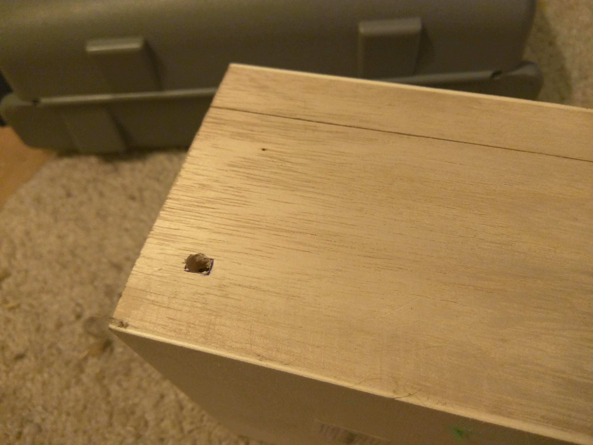
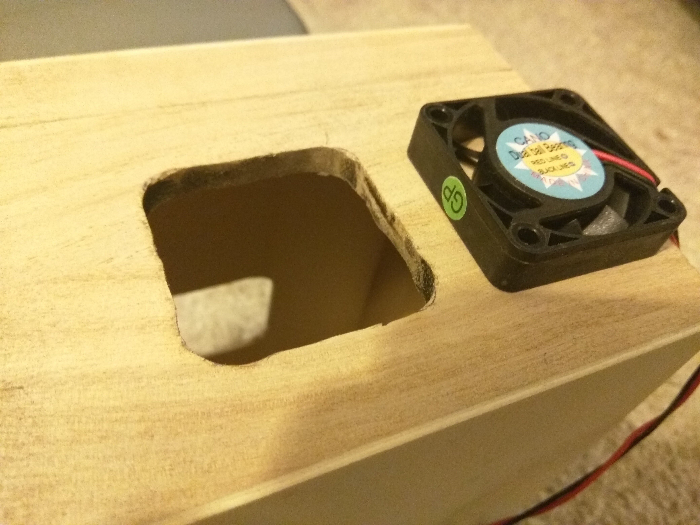
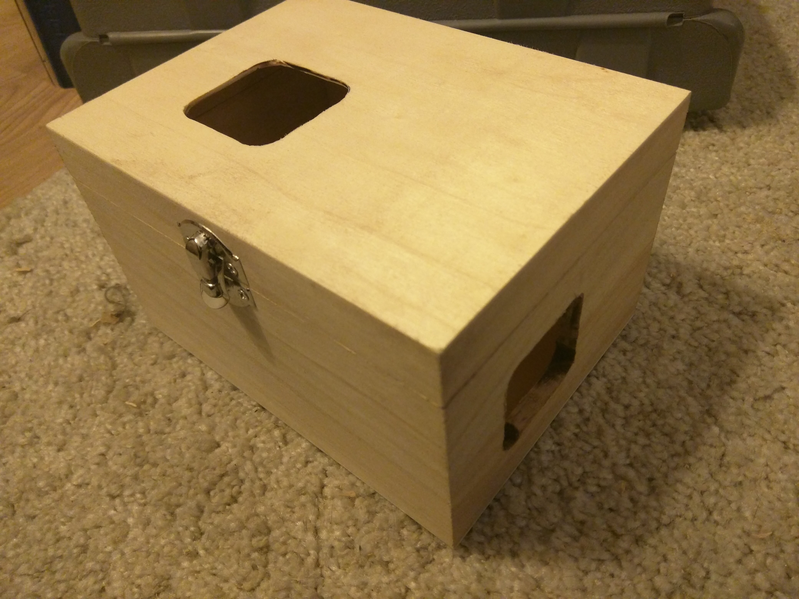

# Requirements

- 1 Raspberry Pi, raspbian installed, an IP address assigned to your Raspberry Pi on the wifi interface
- 1 Arduino Uno
- a led strip: [for example: this one from adafruit](https://www.adafruit.com/product/2842)
- a power supply for the led strip 5V / 2A, and the Arduino (5V / 1A), and the Raspberry Pi (also 5V / 1A), we will use just a single power supply (5V / 6A) for the actual build
- a 1000 µF capacitor and a 470 ohm resistor for the led strip
- a [cable](https://www.amazon.fr/gp/product/B003BZ00CE/ref=od_aui_detailpages01?ie=UTF8&psc=1) to connect your power supply to the grid 
- a structure (3d printed or something else like MDF) for attaching the led strip
- a box for putting the electronics inside (power supply + Arduino + Raspberry Pi), I chose [this box](http://www.creavea.com/coffre-en-bois-a-decorer-rectangulaire-165-cm_boutique-acheter-loisirs-creatifs_43684.html) to customize from a craft and hobbies site
- two small air fans [like these](https://www.amazon.fr/gp/product/B01M2YB9TV/ref=oh_aui_search_detailpage?ie=UTF8&psc=1) to evacuate the heat generated by the electronics
- a Dremel to cut holes in the wood box
- some patience if you have a cat and even more if you have more than one

# Structure

I chose to use MDF since it's cheaper than 3d printing at this size.

### upper disc
- outer radius: 16.6 cm
- inner radius: 12.8 cm
- height: 0.3 cm

### main disc
- outer radius: 15.92 cm
- inner radius: 12.8 cm
- height: 1 cm

### lower disc
- outer radius: 18.2 cm
- inner radius: 14.4 cm
- height: 1 cm

The discs look like this (with the led strip temporarily attached so you can understand):


I will paint them and glue them together so the upper disc covers the side of the led strip (so we only see the light and not the ugly leds), and the main disc will be use for hanging it to the wall (and maybe a mod with translucent cubes to spread the light, that may come later).


# Wiring

The wiring may depend on the led strip that you chose. The [tutorial at Adafruit](https://learn.adafruit.com/adafruit-neopixel-uberguide/basic-connections) is good enough.

You will need a 1000 µF capacitor and a 470 ohm resistor.


# First test of the led strip connected to the Arduino

## Installation of the NeoPixel library

Please download the library for the Arduino for talking to the led strip here:
[Arduino Library Installation](https://learn.adafruit.com/adafruit-neopixel-uberguide/arduino-library-installation)

Recent versions of the Arduino IDE (1.6.2 and later) make library installation super easy via the Library Manager interface. From the Sketch menu, > Include Library > Manage Libraries...  In the text input box type in "NeoPixel". Look for "Adafruit NeoPixel by Adafruit" and select the latest version by clicking on the dropbox menu next to the Install button. Then click on the Install button. After it's installed, you can click the "close" button.


## Upload of the code

To check your wiring, we will use the example Arduino code located in the arduino/v0 folder.

Open the file arduino/v0/v0.ino with your Arduino IDE.

Upload the code to your Arduino connected to an usb port of your computer.

## Test

Plug:
- the wire of the data pin of the led strip to the pin number 6 of your Arduino
- the ground wire to one of the two ground pins of the Arduino
- your led strip to a 5V * 2A power supply.

You should see an animation. If not, check the wiring. The leds should do a animation like on this picture:


# Build

## Wiring

We need to put the cables together in a tube to hide them and then plug all the things to a power source.

Isolate the cables connected to the led strip. Cut the cables and solder them with 3 other longer cables:
- one for power supply (red)
- one for the ground (a dark color)
- one for data (yellow, or white)

I used 2 meter cables, which should be enough excepted if you're a giant.

Cut the cables and keep this apart:


Solder each cable to their respective brother. Put some tape around your soldering to isolate them.


Put the 3 long cables in a tube, like this one (you can do what you want, this is ugly I agree but it's temporary):


## Power supply for the Arduino, the Raspberry Pi, and the led strip

During this step, be *extremely careful* when dealing with power supply from your outlet. Do not drink alcohol while doing this.

Be also careful not to invert the cables since you can burn the components of your Arduino and/or Raspberry Pi.

We are going to use a single power supply for all of them.

### Raspberry Pi

The Raspberry Pi needs 5V. The power IN is the pin n°2 and the ground is the pin n°6 as you can see on this photo:


### Arduino

The Arduino also needs 5V and has two pins named Vin for voltage IN and GND for ground:


### Led strip

The led strip requires 5V and needs to be connected also, use the corresponding 2 cables from the 3 connected to the led strip, so: the red one and the dark/black one.

# Customizing the box

The box will need a small hole for the power supply cable, and two larger ones for the air fans. I chose to put one fan on the right and one on top of the box.

I used a Dremel, the first basic model will do, [like this one](https://www.amazon.fr/Dremel-3000-15-rotatif-multi-usage-accessoires/dp/B0073R1IZ4/ref=sr_1_1?s=hi&ie=UTF8&qid=1485027434&sr=1-1).

Cut the holes for the fans (at their exact shape) with a cutting disc, soften with sandpaper (use your Dremel again).

First hole for the power cord:



Second and third hole for the fans:



So the box should look like that:



---
wip
---

# Installation of the web application

## Apache vhost config

Obviously you should modify these lines according to your Raspberry's configuration. I chose the port 80 that might already be in use. Check with your local BOFH for help.

```
<VirtualHost *:80>
        ServerAdmin webmaster@localhost
        DocumentRoot /var/www/ledclock/webapp/html

        <Directory /var/www/ledclock/webapp/html>
                AllowOverride All
        </Directory>
        
        ErrorLog ${APACHE_LOG_DIR}/error.log
        CustomLog ${APACHE_LOG_DIR}/access.log combined
</VirtualHost>
```

## Installation of the packages and the webapp
```
sudo apt-get install -y php5
sudo apt-get install -y git
sudo su -s /bin/bash www-data
cd /var/www
git clone https://github.com/jarnix/nofussframework.git
git clone https://github.com/jarnix/ledclock.git
sudo chown -R www-data.www-data ledclock
sudo a2enmod rewrite
sudo apt-get install -y php5-intl
sudo service apache2 restart
```

# Usage

http://<ip of your raspberry>

