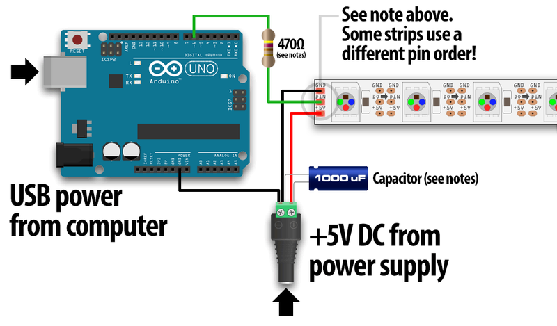

# Requirements

- 1 Raspberry Pi, raspbian installed, an IP address for your Raspberry Pi (use your dhcp server)
- 1 Arduino Uno
- a led strip: [buy this one from adafruit](https://www.adafruit.com/product/2842)
- a power supply for the led strip 5V / 2A, the Arduino (5V) and the Raspberry Pi (also 5V), we will use just a single power supply (5V, 6A) for the actual build
- a structure (3d printed or something else)
- some patience if you have a cat and even more if you have more than one

# Structure

I chose to use MDF since it's cheaper than 3d printing at this size.

### upper disc
- outer radius: 16.6 cm
- inner radius: 12.8 cm
- height: 0.3 cm

### main disc
- outer radius: 15.92 cm
- inner radius: 12.8 cm
- height: 1 cm

### lower disc
- outer radius: 18.2 cm
- inner radius: 14.4 cm
- height: 1 cm

The discs look like this (with the led strip temporarily attached so you can understand):


I will paint them and glue them together so the upper disc covers the side of the led strip (so we only see the light and not the ugly leds), and the main disc will be use for hanging it to the wall (and maybe a mod with translucent cubes to spread the light, that may come later).


# Wiring

The wiring may depend on the led strip that you chose. The [tutorial at Adafruit](https://learn.adafruit.com/adafruit-neopixel-uberguide/basic-connections) is good enough.



# First test of the led strip connected to the Arduino

To check your wiring, use the arduino code located in the arduino/v0 folder.

Be sure to download the library for the Arduino here:
[Arduino Library Installation](https://learn.adafruit.com/adafruit-neopixel-uberguide/arduino-library-installation)

## Installation of the NeoPixel library
Recent versions of the Arduino IDE (1.6.2 and later) make library installation super easy via the Library Manager interface. From the Sketch menu, > Include Library > Manage Libraries...  In the text input box type in "NeoPixel". Look for "Adafruit NeoPixel by Adafruit" and select the latest version by clicking on the dropbox menu next to the Install button. Then click on the Install button. After it's installed, you can click the "close" button.


Upload the v0.ino to your Arduino connected to an usb port of your computer.

## Test

Plug:
- the wire of the data pin of the led strip to the pin number 6 of your Arduino
- the ground wire to one of the two ground pins of the Arduino
- your led strip to a 5V * 2A power supply.

You should see an animation. If not, check the wiring.


# Build

## Wiring

We need to put the cables together in a tube.

Isolate the capacitor and the connector. Cut the cable and solder 3 long cables:
- one for power supply (red)
- one for the ground (a dark color)
- one for data (yellow, or white)

Cut the cables and keep this apart:


Solder each cable to their respective brother. Put some tape around your soldering to isolate them.


Put the 3 long cables in a tube, like this one (you can do what you want, this is ugly I agree but it's temporary):


## Power supply for the Arduino, the Raspberry Pi, and the led strip

During this step, be *extremely careful* when dealing with power supply from your outlet. Do not drink alcohol while doing this.

Be also careful not to invert the cables since you can burn the components.

We are going to use a single power supply for all of them.

### Raspberry Pi

The Raspberry Pi needs a 5 V. The power IN is the pin n°2 and the ground is the pin n°6 as you can see on this photo:


### Arduino

The Arduino has two pins named Vin for voltage IN and GND for ground:


### Led strip

The led strip needs to be connected also, use the corresponding 2 cables from the 3 connected to the led strip.

# Installation of the web application

## Apache vhost config

Obviously you should modify these lines according to your Raspberry's configuration. I chose the port 80 that might already be in use. Check with your local BOFH for help.

```
<VirtualHost *:80>
        ServerAdmin webmaster@localhost
        DocumentRoot /var/www/ledclock/webapp/html

        <Directory /var/www/ledclock/webapp/html>
                AllowOverride All
        </Directory>
        
        ErrorLog ${APACHE_LOG_DIR}/error.log
        CustomLog ${APACHE_LOG_DIR}/access.log combined
</VirtualHost>
```

## Installation of the packages and the webapp
```
sudo apt-get install -y php5
sudo apt-get install -y git
sudo su -s /bin/bash www-data
cd /var/www
git clone https://github.com/jarnix/nofussframework.git
git clone https://github.com/jarnix/ledclock.git
sudo chown -R www-data.www-data ledclock
sudo a2enmod rewrite
sudo apt-get install -y php5-intl
sudo service apache2 restart
```

# Usage

http://<ip of your raspberry>

